### 第0章 写在前面

#### 最好下载并可编译以下源码

- libdispatch
- objc4
- gnustep-base

#### BitCode

LLVM是目前苹果采用的编译器工具链,Bitcode是LLVM编译器的中间代码的一种编码,LLVM的前端可以理解为C/C++/OC/Swift等编程语言,LLVM的后端可以理解为各个芯片平台上的汇编指令或者可执行机器指令数据,那么,BitCode就是位于这两者直接的中间码. LLVM的编译工作原理是前端负责把项目程序源代码翻译成Bitcode中间码,然后再根据不同目标机器芯片平台转换为相应的汇编指令以及翻译为机器码.这样设计就可以让LLVM成为了一个编译器架构,可以轻而易举的在LLVM架构之上发明新的语言(前端),以及在LLVM架构下面支持新的CPU(后端)指令输出,虽然Bitcode仅仅只是一个中间码不能在任何平台上运行,但是它可以转化为任何被支持的CPU架构,包括现在还没被发明的CPU架构,也就是说现在打开Bitcode功能提交一个App到应用商店,以后如果苹果新出了一款手机并CPU也是全新设计的,在苹果后台服务器一样可以从这个App的Bitcode开始编译转化为新CPU上的可执行程序,可供新手机用户下载运行这个App.

但是bitcode给开发者带来的不便之处就是: 没用bitcode之前,当应用程序奔溃后,开发者可以根据获取的的奔溃日志再配上上传到苹果服务器的二进制文件的调试符号表信息可以还原程序运行过程到奔溃时后调用栈信息,对问题进行定位排查.但是用了bitcode之后,用户安装的二进制不是开发者这边生成的,而是苹果服务器经过优化后生成的,其对应的调试符号信息丢失了,也就无法进行前面说的还原奔溃现场找原因了.

#### 编译过程

`iOS` 编译采用 `Clang` 作为编译器前端，`LLVM` 作为编译器后端，编译器前端负责语法分析，语义分析，生成生成中间码 `(LLVM IR)`，在这个过程中，会进行类型检查，如果发现错误或者警告会标注出来在哪一行；编译器后端会进行机器无关的代码优化，生成机器语言，并且进行机器相关的代码优化。

##### Clang 的编译过程

1. 预处理

2. 词法分析

3. 语法分析

4. 静态分析

5. 类型检查

##### LLVM 的编译过程

1. 目标代码的生成与优化（语法树->中间码->汇编代码）

2. 汇编（目标代码需要经过汇编器处理，把汇编语言文件转换为机器码文件）

3. 链接，静态链接（动态链接运行时，多个程序用一个，运行时多个程序可以共享同一段代码）

#### 加载过程

1. exe()
2. 加载可执行文件
3. Dyld&动态链接库加载
4. Rebase&Bind
5. Objc
6. initializer

#### Mach-O


### 第3章 UI视图

#### 事件传递（找到点击的View）

`hitTest:withEvent:`

UIApplication->UIWindow->UIViewController->UIView

#### 事件响应（找到响应的View）

UIView->UIViewController->UIWindow->UIApplication

#### 异步绘制

```sequence
Note over MainQueue: [UIView setNeedDisplay]
Note over MainQueue: [CALayer display]
Note over MainQueue: [UIView displayLayer:]
MainQueue->AsyncQueue:
Note over AsyncQueue: CoreGraphic Api
AsyncQueue->MainQueue:
Note over MainQueue: [CALayer setContents:]
```

#### 离屏渲染

- On-Screen Rendering
	
	意为**当前屏幕渲染**，指的是GPU的缓冲操作是在当前屏幕缓冲区中进行

- Off-Screen Rendering

  意为**离屏渲染**，指的是GPU在当前屏幕缓冲区以外**新开辟**一个缓冲区进行渲染操作

##### 何时触发

- 圆角（maskToBounds为YES）
- 图层蒙板
- 阴影
- 光栅化

##### 为何要避免

1. 增加GPU的工作量，有可能导致掉帧
2. 创建新的缓冲区
3. 上下文切换，多个渲染管线合成

### 第4章 Objective-C语言特性

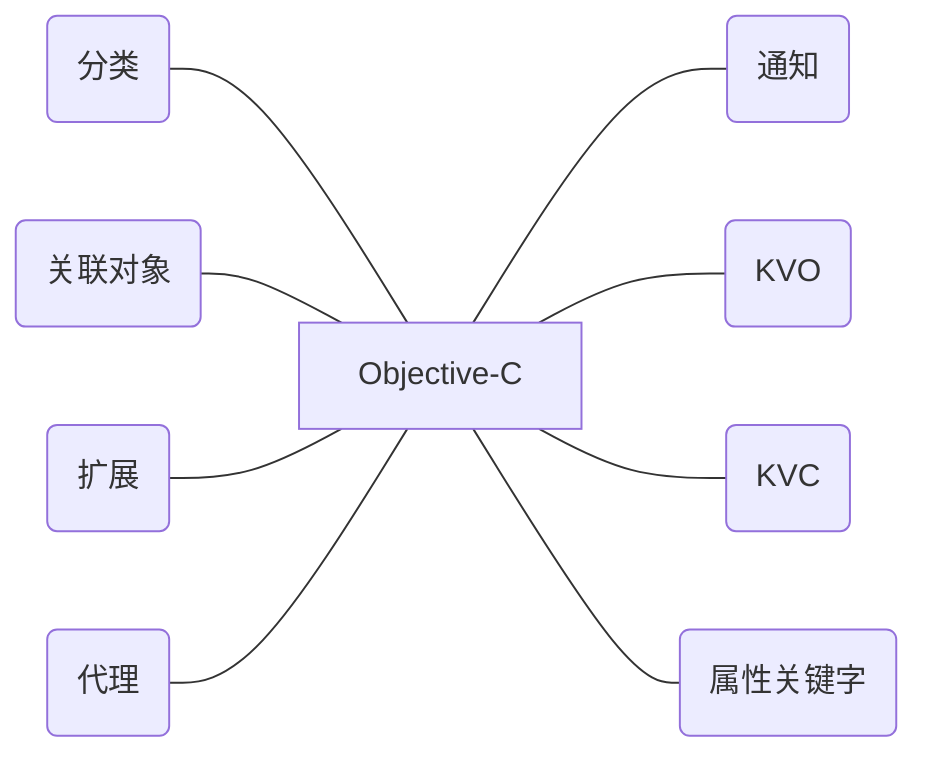

#### 分类

```c++
struct category_t {
    const char *name;
    classref_t cls;
    struct method_list_t *instanceMethods;
    struct method_list_t *classMethods;
    struct protocol_list_t *protocols;
    struct property_list_t *instanceProperties;
    // Fields below this point are not always present on disk.
    struct property_list_t *_classProperties;

    method_list_t *methodsForMeta(bool isMeta) {
        if (isMeta) return classMethods;
        else return instanceMethods;
    }

    property_list_t *propertiesForMeta(bool isMeta, struct header_info *hi);
    
    protocol_list_t *protocolsForMeta(bool isMeta) {
        if (isMeta) return nullptr;
        else return protocols;
    }
};
```


##### 作用

- 声明私有方法
- 分解体积庞大的类文件
- 把Framework的私有方法公开

##### 特点

- 运行时决议
- 可以为系统类添加分类

##### 可添加的内容

- 实例方法
- 类方法
- 协议
- 属性（getter&setter）

##### 关联对象的本质

关联对象由**AssociationsManager**管理并在**AssociationsHashMap**存储，所有关联对象的关联内容在同一个全局容器中

```json
{
  "0x1233232312": {
    "@selector(text)": {
      "value": "Hello"
      "policy": "retain"
    },
    "@selector(title)": {
      "value": "Hello"
      "policy": "retain"
    }
  },
  "0x1233232312": {
    "@selector(name)": {
      "value": "Hello"
      "policy": "retain"
    }
  }
}
```

#### 扩展

只声明不实现

##### 作用

- 声明私有属性
- 声明私有方法
- 声明私有成员变量

##### 特点

- 编译时决议
- 只以声明的形式存在，多数情况下寄生于宿主类的.m中
- 不能为系统类添加扩展

#### NSNotification

#### KVO

- Isa-swizzling
- kvc设置value能生效
- 下划线修改value不能生效

#### KVC

```flow
A=>start: Start
B=>condition: has setter
C=>operation: Invoke
D=>end: End
E=>condition: has instance var
F=>operation: setValue:forUndefinedKey:
G=>operation: NSUndefinedKeyException
A->B
B(yes)->C->D
B(no)->E
E(yes)->C->D
E(no)->F->G->D
```


#### copy关键字

| 源对象类型    | 拷贝方式    | 目标对象类型 | 拷贝类型(深/浅) |
| ------------- | ----------- | ------------ | --------------- |
| mutable对象   | copy        | 不可变       | 深拷贝          |
| mutable对象   | mutableCopy | 可变         | 深拷贝          |
| immutable对象 | copy        | 不可变       | 浅拷贝          |
| immutable对象 | mutableCopy | 可变         | 深拷贝          |

### 第5章 Runtime

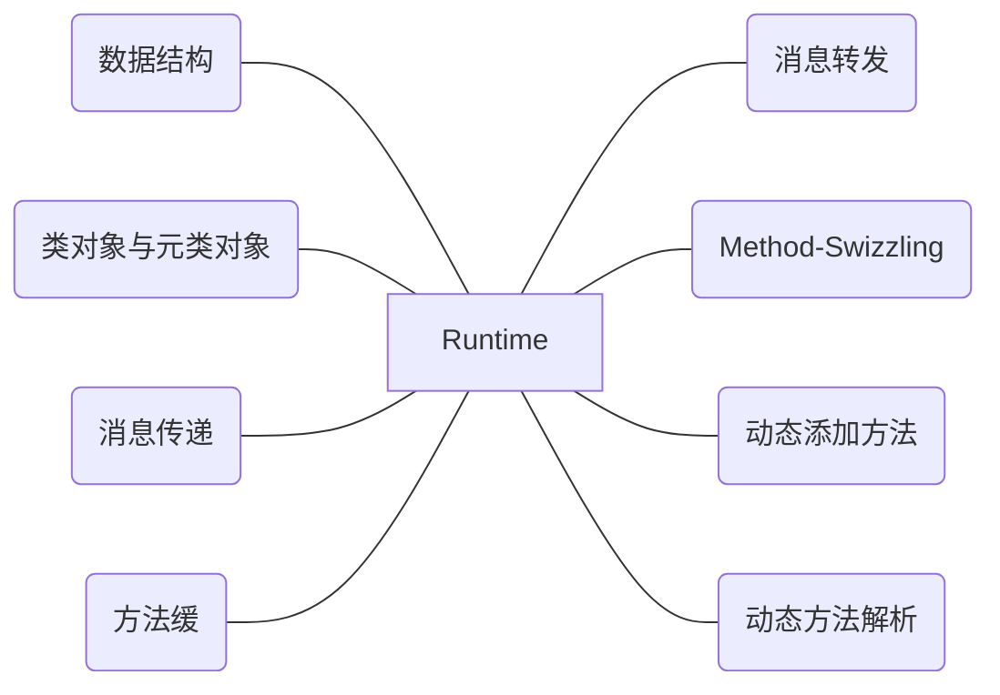

#### isa指针

共同体isa_t

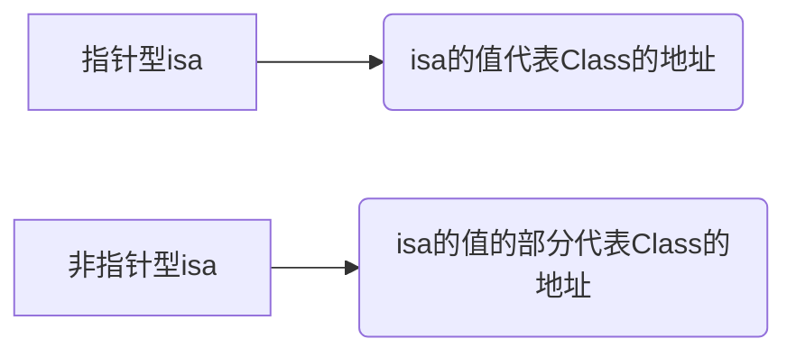

#### objc_class的结构


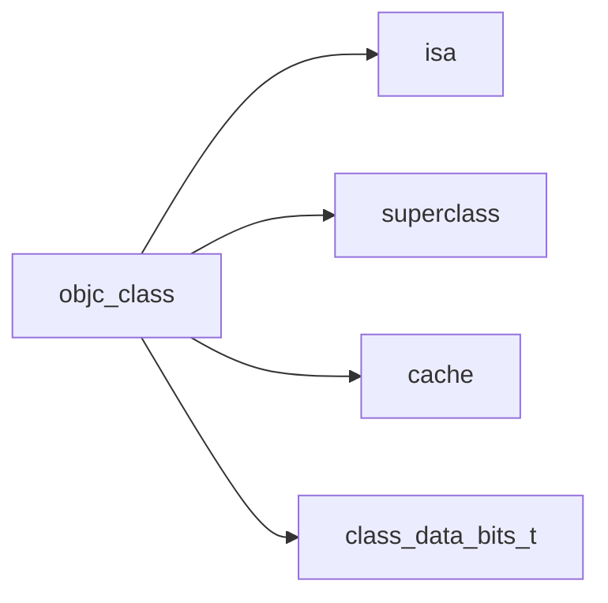

#### isa指向

- 关于对象，其指向类对象
- 关于类对象，其指向元类对象


#### cache_t

- 用户快速查找方法执行函数
- 是可增量扩展的`Hash表`结构
- 是局部性原理的最佳应用


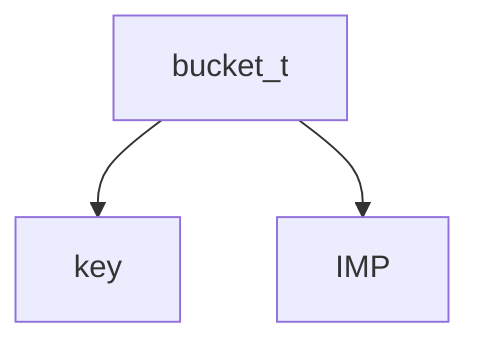

#### class_data_bits_t

- `class_data_bits_t`主要是对`class_rw_t`的封装
- `class_rw_t`代表了类相关的`读写`信息、对`class_ro_t`的封装
- `class_ro_t`代表了类相关的只读信息
- `class_ro_t`编译后就决定了
- `class_rw_t`运行时决定


#### method_t

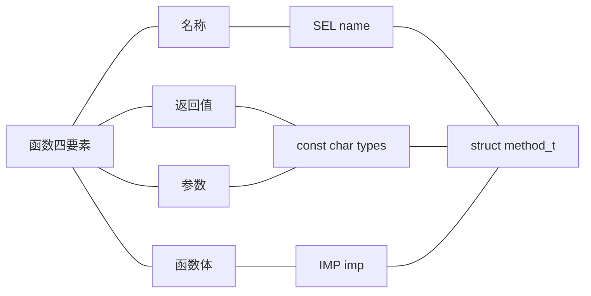

#### 对象、类对象、元类对象

- **类对象**存储实例方法列表等信息
- **元类对象**存储类方法列表等信息


#### 消息传递

```objective-c
struct objc_super {
    /// Specifies an instance of a class.
    __unsafe_unretained _Nonnull id receiver;
    /// Specifies the particular superclass of the instance to message. 
    __unsafe_unretained _Nonnull Class super_class;
};
```

```flow
A=>start: 开始
B=>condition: 缓存
C=>condition: 父类方法列表
D=>condition: 逐级父类方法列表
E=>operation: Invoke
F=>operation: 消息转发
G=>end: 结束
A->B
B(yes)->E->G
B(no)->C
C(yes)->E
C(no)->D
D(yes)->E
D(no)->F
F->G
```

##### 缓存查找

哈希查找

给定值是`SEL`，目标值是对应的`bucket_t`中的`IMP`

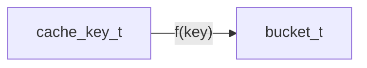

f(key) = key & mask

##### 当前类中查找

- 对于`已经排好`的列表，采用`二分查找`
- 对于`没有排序`的列表，采用`一般便利`

##### 父类逐级查找

```flow
A=>start: 开始
B=>operation: curClass=curClass->superclass
C=>condition: curClass==nil
D=>condition: 缓存是否命中
E=>condition: 方法列表是否命中
F=>end: 结束
A->B->C
C(yes)->F
C(no)->D
D(yes)->F
D(no)->E
E(yes)->F
E(no)->B
```

#### 消息转发

##### 实例的消息转发

```flow
AA=>start: 开始
ZZ=>end: 结束
A=>operation: result = +(BOOL)resolveInstanceMethod:(SEL)sel
B=>condition: result
C=>operation: target = -(id)forwardingTargetForSelector:(SEL)aSelector
D=>condition: target!=nil
E=>operation: signature = -(NSMethodSignature *)methodSignatureForSelector:(SEL)aSelector
F=>condition: signature!=nil
G=>operation: -(void)forwardInvocation:(NSInvocation *)anInvocation
H=>operation: 消息已处理
I=>operation: 消息无法处理
AA->A->B
B(no)->C->D
B(yes, right)->H
D(no)->E->F
D(yes, right)->H
F(yes, right)->G->H
F(no)->I
H->ZZ
I->ZZ
```

##### 类的消息转发

```objective-c
+ (BOOL)resolveClassMethod:(SEL)sel
+ (id)forwardingTargetForSelector:(SEL)sel
+ (NSMethodSignature *)methodSignatureForSelector:(SEL)sel
+ (void)forwardInvocation:(NSInvocation *)invocation
+ (void)doesNotRecognizeSelector:(SEL)sel
```

#### 动态方法解析

`@dynamic:`getter&setter 运行时添加而不是编译时添加

- 动态运行时语言将函数决议推迟到运行时
- 编译时语言在编译期进行函数决议

### 第6章 内存管理

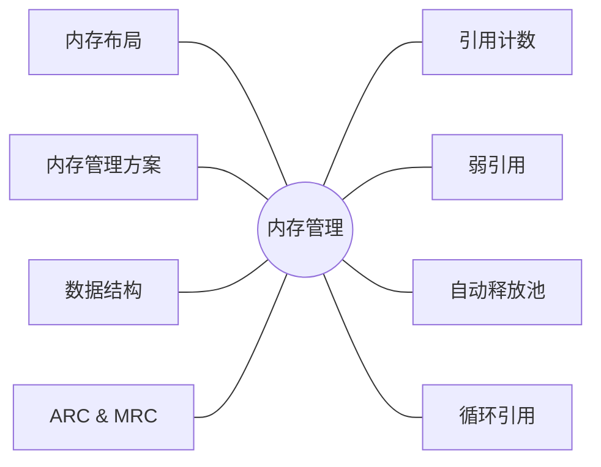


#### 对象内存大小

- 内存对齐：最大指针的整数倍
- iOS按16、32、48... 16的整数倍来取大小

```
1、数据的开始在CPU读取的0字节处，这刚CPU一次就你能够读取完毕
2、数据的开始没在0字节处，假设在1字节处吧，CPU要先将0~3字节读取出来，在读取4~7字节的内容。然后将0~3字节里的0字节丢弃，将4~7字节里的5，6，7字节的数据丢弃。然后组合1,2,3,4的数据。
由此可以看出，CPU读取的效率不是很高，可以说比较繁琐。
但如果有内存对齐的话：
由于每一个数据都是对齐好的，CPU可以一次就能够将数据读取完成，虽然会有一些内存碎片，但从整个内存的大小来说，都不算什么，可以说是用空间换取时间的做法。
```

#### 内存管理方案

##### TaggedPointer(小对象)

##### NONPOINTER_ISA

1. **0**位标记是否是纯ISA指针，还是非指针型的NONPINTER_ISA指针 `indexed`
2. **1**位标记是否有关联对象 `has_assoc`
3. **2**位标记是否使用C++相关内容，在ARC下也可以标记对象是否通过ARC来管理的 `has_cxx_dtar`
4. **3~35**位标记当前类对象的指针地址
5. **36**位 `magic`
6. **37**位标记对象是否有弱引用指针 `weakly_referenced`
7. **38**位标记对象是否正在dealloc `deallocating`
8. **39**位标记对象是否有SideTable结构用于存储引用计数 `has_sidetable_rc`
9. **40~63**位标记对象的引用计数 extrac_rc

##### 散列表

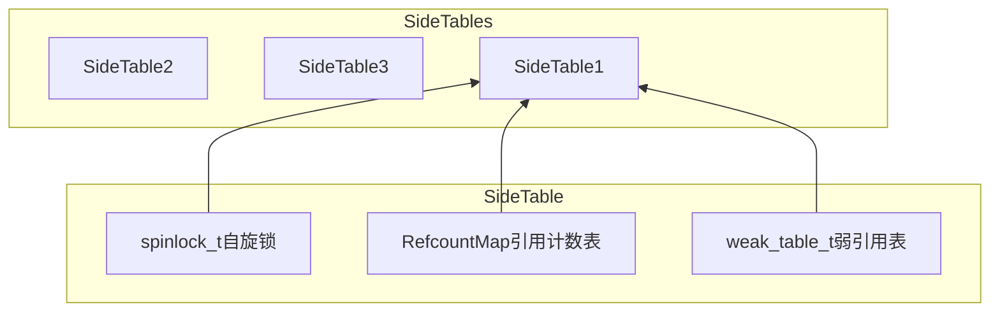

SideTables的本质是一张`Hash表`

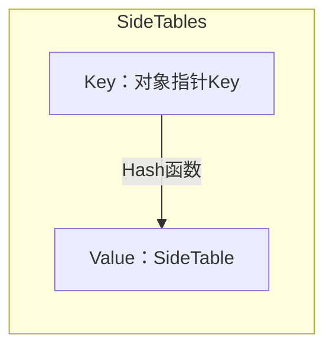

#### SideTable

##### spinlock_t

- `spinlock_t`是"忙等"的锁（自旋锁）
- 适用于轻量访问

##### RefcountMap

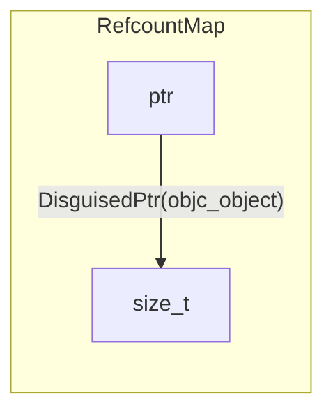

1. size_t **0** 位表示是否有弱引用 `weak_referenced`
2. size_t **1** 位表示是否正在 `deallocating`
3. size_t **2~63** 位表示引用计数 `retaincount`

##### weak_table_t

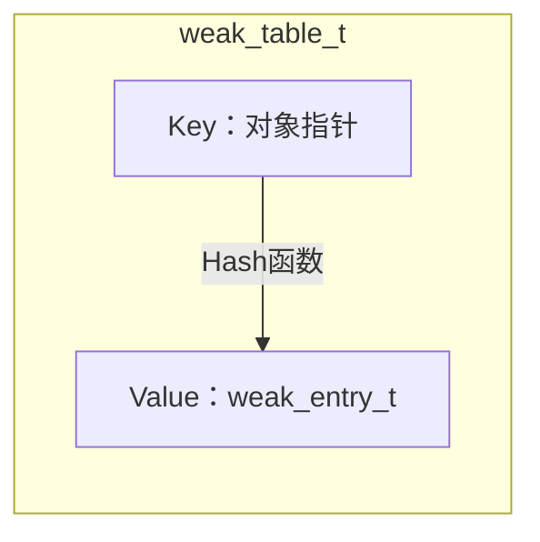

weak_entry_t是结构体数组，存放了弱引用指针

#### MRC&ARC

- MRC是通过一些方法手动操作引用计数
- ARC是LLVM（编译器）和Runtime（运行时）协作的结果
- ARC中禁止手动调用retain/release/retainCount/dealloc
- ARC中新增了`weak`、`strong`属性关键字

##### 引用计数管理

###### alloc

经过一系列调用，最终调用C函数calloc。此时并没有设置引用计数为1

###### strong

- 如果是直接对普通对象**strong**

  会直接调用**retain**方法**objc_retain(id obj)**

- 如果是对**weak**对象调用**strong**

  会调用**objc_loadWeakRetained(id *location)**

- 如果有**arc**下**block**有**weak**，然后**strong**

  ```flow
  A=>start: objc_initWeak()
  B=>operation: objc_copyWeak(id *dst, id *src)
  C=>operation: objc_loadWeakRetained(id *location)
  D=>end: objc_storeStrong(id *location, id obj)
  A->B->C->D
  ```


```c++
void objc_storeStrong(id *location, id obj) {
    id prev = *location;
    if (obj == prev) {
        return;
    }
    objc_retain(obj);
    *location = obj;
    objc_release(prev);
}
```

###### retain

```objective-c
void
SideTable &table = SideTables()[this]
size_t *refcntStorage = talbe.refcnts.find(this)
refcntStorage += SIDE_TABLE_RC_ONE
```

###### release

```objective-c
SideTable &table = SideTables()[this]
RefcountMap::interator it = talbe.refcnts.find(this)
it->second -= SIDE_TABLE_RC_ONE 
```

###### retainCount

```objective-c
SideTable &table = SideTables()[this]
size_t refcnt_result = 1
RefcountMap::interator it = talbe.refcnts.find(this)
refcnt_result += it->second >> SIDE_TABLE_RC_SHIFT
```

###### dealloc

```flow
A=>start: [[NSObject new] dealloc]
B=>operation: _objc_rootDealloc(self)
C=>operation: obj->rootDealloc()
D=>condition: 判断是否可
以直接清除
E=>end: free(this)
F=>operation: object_dispose((id)this)
G=>operation: objc_destructInstance(obj)
H=>condition: obj->
hasCxxDtor()
I=>condition: obj->
hasAssociatedObjects()
J=>operation: object_cxxDestruct(obj)
K=>operation: _object_remove_assocations(obj)
L=>operation: obj->clearDeallocating()
A->B->C->D
D(yes, right)->E
D(no)->F->G->H
H(yes, right)->J->I
H(no)->I
I(yes, right)->K->L
I(no)->L->E
```

```c++
inline void
objc_object::rootDealloc()
{
    if (isTaggedPointer()) return;  // fixme necessary?

    if (fastpath(isa.nonpointer  &&  
                 !isa.weakly_referenced  &&  
                 !isa.has_assoc  &&  
                 !isa.has_cxx_dtor  &&  
                 !isa.has_sidetable_rc))
    {
        assert(!sidetable_present());
        free(this);
    } 
    else {
        object_dispose((id)this);
    }
}
```

```c++
inline void 
objc_object::clearDeallocating()
{
    if (slowpath(!isa.nonpointer)) {
        // Slow path for raw pointer isa.
        sidetable_clearDeallocating();
    }
    else if (slowpath(isa.weakly_referenced  ||  isa.has_sidetable_rc)) {
        // Slow path for non-pointer isa with weak refs and/or side table data.
        clearDeallocating_slow();
    }

    assert(!sidetable_present());
}
```

```c++
NEVER_INLINE void
objc_object::clearDeallocating_slow()
{
    ASSERT(isa.nonpointer  &&  (isa.weakly_referenced || isa.has_sidetable_rc));

    SideTable& table = SideTables()[this];
    table.lock();
    if (isa.weakly_referenced) {
        weak_clear_no_lock(&table.weak_table, (id)this);
    }
    if (isa.has_sidetable_rc) {
        table.refcnts.erase(this);
    }
    table.unlock();
}
```

##### 弱引用管理

###### 添加weak变量

```objective-c
id __weak obj1 = obj;
////////////////////
id obj1;
objc_initWeak(&objc1, obj)
```

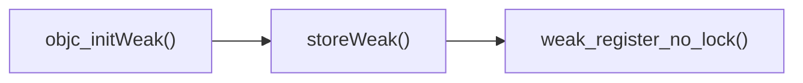

1. 判断指针地址是否有关联**旧对象**，有关联对象记录关联旧对象的**oldTable**
2. 判断是否传入对象是否存在，存在记录对象的**newTable**
3. 删除就对象的weak引用**weak_unregister_no_lock**
4. 关联指针和新对象**weak_register_no_lock**
5. 判断是否是弱对象
6. 在**newTable**找到对应的**weak_entry_t**，没有直接创建，通过Hash运算**weak_entry_for_referent()**
7. weak_entry_t的长度好像是4

###### 清除weak变量，同时设置指向为nil

#### 自动释放池

- 自动释放池是一个双向链表


- `AutoreleasePoolPage`里有parent、child、thread、next指针，其中next代表栈当中下一个可填充的位置，自动释放池和线程一一对应

```objective-c
class AutoreleasePoolPage {
    magic_t const magic;
    id *next;
    pthread_t const thread;
    AutoreleasePoolPage * const parent;
    AutoreleasePoolPage *child;
    uint32_t const depth;
    uint32_t hiwat;
}
```


- `objc_autoreleasePoolPush`会传入一个哨兵对象（POOL_SENTINEL），其值为nil
- 在往Page里添加新元素时都会进行一下三种判断

```objective-c
static inline id *autoreleaseFast(id obj)
{
   AutoreleasePoolPage *page = hotPage();
   if (page && !page->full()) {
       return page->add(obj);
   } else if (page) {
       return autoreleaseFullPage(obj, page);
   } else {
       return autoreleaseNoPage(obj);
   }
}
```

- `objc_autoreleasePoolPop`会将哨兵对象传入并且调用pageForPointer对哨兵地址4096取模，取到应该停止的page

```objective-c
static AutoreleasePoolPage *pageForPointer(const void *p) {
    return pageForPointer((uintptr_t)p);
}

static AutoreleasePoolPage *pageForPointer(uintptr_t p) {
    AutoreleasePoolPage *result;
    uintptr_t offset = p % SIZE;

    assert(offset >= sizeof(AutoreleasePoolPage));

    result = (AutoreleasePoolPage *)(p - offset);
    result->fastcheck();

    return result;
}
```

- 之后调用`releaseUntil`方法，判断当前page是否为空，将当前page的next指针前移，获取next的值为obj，并且擦出next指针上内容，如果obj没到page边界，那么发送objc_release，知道next指针指向哨兵地址

```objective-c
void releaseUntil(id *stop) {
    while (this->next != stop) {
        AutoreleasePoolPage *page = hotPage();

        while (page->empty()) {
            page = page->parent;
            setHotPage(page);
        }

        page->unprotect();
        id obj = *--page->next;
        memset((void*)page->next, SCRIBBLE, sizeof(*page->next));
        page->protect();

        if (obj != POOL_SENTINEL) {
            objc_release(obj);
        }
    }

    setHotPage(this);
}
```

- 判断当前page是否有child，如果有并且当前page不足一半，清除child，否则清除child的child

```objective-c
static inline void pop(void *token) {
    AutoreleasePoolPage *page = pageForPointer(token);
    id *stop = (id *)token;

    page->releaseUntil(stop);

    if (page->child) {
        if (page->lessThanHalfFull()) {
            page->child->kill();
        } else if (page->child->child) {
            page->child->child->kill();
        }
    }
}
```
- autorelease释放时机


> 在一段同步的代码中执行过程中，生成的对象接受autorelease消息后，一般是不会在作用域结束前释放的。
> 所以严谨的说, 在没有手动添加Autorelease Pool的情况下，Autorelease对象是在当前的runloop迭代结束时释放的


#### 循环引用

##### 自循环引用，对象中obj持有了自己

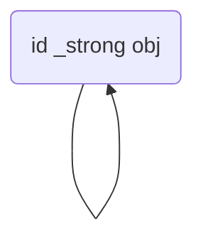

##### 相互循环引用

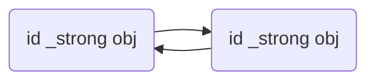

##### 多循环引用

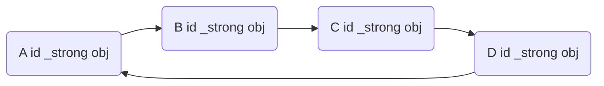

##### NSTimer的循环引用问题

设置一个中间对象，在中间对象执行定时任务时检查对象是否释放，释放了销毁定时器


### 第7章 Block

#### 什么是Block

- **Block**是将**函数**及其**上下文**封装起来的**对象**

#### 全局变量&静态全局变量区别

#### 截获变量

- 对于**基本数据**类型的**局部变量**截获其值
- 对于**对象**类型的局部变量**连同所有权修饰符**一起截获
- 对于**局部静态变量**以**指针形式**截获
- 对于**全局变量、全局静态变量**不截获

#### __block修饰符

- **一般情况下**，对截获变量进行**复制**操作需要添加**__block修饰符**

```mermaid
graph LR
		subgraph don't need
				E[不需要__block修饰符] --> F[静态局部变量]
				E --> G[全局变量]
				E --> H[静态全局变量]
		end
    subgraph need
				A[需要__block修饰符] --> B[局部变量]
				B --> C[基本数据类型]
				B --> D[对象类型]
		end
```

- **__block**修饰的变量变成了**对象**

```objective-c
__block int value = 2;
value = 4;
// 编译成对象
struct __Block_byref_value_0 {
  void *__isa; // isa指针
__Block_byref_value_0 *__forwarding; // 栈上的指向自己
 int __flags;
 int __size;
 int value; // 值
};
// 栈上的通过forwarding指针找自己改变值
(value.__forwarding->value) = 4;
```

#### Block的内存管理

Block的Copy操作

|        Block类型        |   源   |  Copy结果  |
| :---------------------: | :----: | :--------: |
| __NSConcreteStackBlock  |   栈   |     堆     |
| __NSConcreteGlobalBlock | 数据区 | 什么也不做 |
| __NSConcreteMallocBlock |   堆   | 引用计数+1 |

栈Block copy后Block及其**__block**修饰的变量都会在堆上复制一份，并且栈上**__block**中**fowarding**指针指向堆__block，这样可以保证无论怎么操作访问的变量是同一个


### 第8章 多线程

```mermaid
graph LR
	A(多线程) --> B[GCD]
	A --> C[NSOperation]
	A --> D[NSThread]
	A --> E[多线程与锁]
```

#### GCD

##### 同步/异步 和 串行/并发

####  NSOperation

需要和NSOpertaionQueue配合使用来实现多线程方案，相比GCD有以下优势

- 添加任务依赖
- **任务执行状态控制**
- 最大并发量

##### 任务执行状态

- isReady
- isExecuting
- isFinished
- isCancelled

>  NSOperationQueueDefaultMaxConcurrentOperationCount
> This number is determined dynamically based on current system conditions.

##### 状态控制

- 如果只重写了**main**方法，底层控制变更任务执行、完成以及退出状态
- 如果重写了**start**方法，自行控制任务状态

> GNUstep叼叼叼

#### NSThread

如何常住线程

#### 锁

[谈一谈 iOS 的锁](https://cloud.tencent.com/developer/article/1505582)

- pthread_mutex

  不是使用忙等，而是同信号量一样，会阻塞线程并进行等待，调用时进行线程上下文切换。

  `pthread_mutex`本身拥有设置协议的功能，通过设置它的协议，来解决优先级反转

- [@synchronized（objc_sync_enter/objc_sync_exit/recursive_mutex_t递归锁/SyncData）](https://juejin.im/post/5e66eea4f265da57375c5181)

  一般在创建单例对象的时候使用

  另外一种情况，就是 `@synchonized(self)`. 不少代码都是直接将self传入@synchronized当中，而 `self` 很容易作为一个外部对象，被调用和修改。所以它和上面是一样的情况，需要避免使用。
  正确的做法是什么？obj 应当传入一个类内部维护的`NSObject`对象，而且这个对象是对外不可见的,不被随便修改的。@synchronized不能锁**nil**对象

- atomic

  修饰属性的关键字，对被修饰对象进行原子操作（不负责使用）

- OSSpinLock（spinlock_t自旋锁）

  **循环等待**访问，不释放当前资源，用于轻量级数据访问，简单的int值+1/-1操作

- NSRecusiveLock（recursive_mutex_t递归锁）

- NSLock

  堆pthread_mutex的封装的互斥锁

- NSCondition

- dispatch_semaphore_t

#### dispatch_semaphore_t

##### dispatch_semaphore_create

```objective-c
struct dispatch_semaphore_s {
  void *do_ctxt; \
  void *do_finalizer
  long volatile dsema_value;
  long dsema_orig;
  _dispatch_sema4_t dsema_sema;
  // DISPATCH_OBJECT_HEADER(semaphore);
  struct _os_object_s _as_os_obj[0];
  OS_OBJECT_STRUCT_HEADER(dispatch_##x);
  struct dispatch_##x##_s *volatile do_next;
  struct dispatch_queue_s *do_targetq;
};

dispatch_semaphore_t
dispatch_semaphore_create(long value)
{
  dispatch_semaphore_t dsema;

  // If the internal value is negative, then the absolute of the value is
  // equal to the number of waiting threads. Therefore it is bogus to
  // initialize the semaphore with a negative value.
  if (value < 0) {
  	return DISPATCH_BAD_INPUT;
  }
  // 建立一个vtable。vtable是虚函数表，可以通过索引方式来快速获取方法。相比于OC的方法查找，vtable的方式会有极大的性能提升。
  dsema = _dispatch_object_alloc(DISPATCH_VTABLE(semaphore),
  sizeof(struct dispatch_semaphore_s));
  dsema->do_next = DISPATCH_OBJECT_LISTLESS; // 
  dsema->do_targetq = _dispatch_get_default_queue(false); // 目标队列
  dsema->dsema_value = value; // 当前值
  _dispatch_sema4_init(&dsema->dsema_sema, _DSEMA4_POLICY_FIFO); 
  dsema->dsema_orig = value; // 原始值
  return dsema;
}
```

##### dispatch_semaphore_wait

```flow
A=>start: dispatch_semaphore_wait
ZZ=>end: 结束
B=>operation: --dsema_value
C=>condition: value<0
D=>operation: _dispatch_semaphore_wait_slow(dsema, timeout)
E=>condition: timeout==now
F=>condition: timeout==forever
G=>operation: _dispatch_sema4_wait(&dsema->dsema_sema)
H=>operation: do { kr = semaphore_wait(*sema) 
} while (kr == KERN_ABORTED)
I=>operation: _DSEMA4_TIMEOUT()
J=>operation: _dispatch_sema4_timedwait(&dsema->dsema_sema, timeout)
K=>operation: do { kr = semaphore_timedwait(*sema, _timeout);
} while (unlikely(kr == KERN_ABORTED))
L=>condition: kr==TIMED_OUT
A->B->C
C(yes)->D->E
C(no)->ZZ
E(no)->F
E(yes, right)->I->ZZ
F(no)->J->K->L
F(yes, right)->G->H->ZZ
L(yes)->ZZ
L(no)->ZZ
```

##### dispatch_semaphore_signal

```flow
A=>start: dispatch_semaphore_signal
B=>operation: ++dsema_value
C=>condition: value<=0
D=>operation: _dispatch_semaphore_signal_slow(dsema)
E=>operation: _dispatch_sema4_signal
F=>operation: 通过wait的先后顺序唤醒一个等待
G=>end: 结束
A->B->C
C(yes)->D->E->F->G
C(no, right)->G
```

##### _dispatch_semaphore_dispose

```flow
A=>start: _dispatch_semaphore_dispose
B=>condition: dsema_value<
dsema_orig
C=>operation: _dispatch_sema4_dispose(sema, policy)
D=>operation: _dispatch_sema4_dispose_slow(sema, policy)
E=>operation: semaphore_destroy(mach_task_self(), sema_port)
F=>operation: 异常，还有信号量在使用，不能释放
G=>end: 结束
A->B
B(no)->C->D->E->G
B(yes,right)->F->G
```

```objective-c
dispatch_semaphore_t sema = dispatch_semaphore_create(1);
dispatch_semaphore_wait(sema, DISPATCH_TIME_FOREVER);
// 下面这个就会崩溃，因为赋值了新的信号量，而旧的在使用就被释放了
sema = dispatch_semaphore_create(1);
```

#### 其它保证线程安全的方式

- 使用单线程访问

  首先，尽量避免多线程的设计。因为多线程访问会出现很多不可控制的情况。有些情况即使上锁，也无法保证百分之百的安全，例如自旋锁的问题。

- 不对资源做修改

### 第9章 RunLoop

[RunLoop](https://developer.apple.com/library/archive/documentation/Cocoa/Conceptual/Multithreading/RunLoopManagement/RunLoopManagement.html#//apple_ref/doc/uid/10000057i-CH16-SW1)

Runloop是通过内部维护的**事件循环**来对**事件&消息**进行管理的一个对象。没有消息需要处理时，休眠以免资源占用；有消息处时，立刻被唤醒。

> Run loops are part of the fundamental infrastructure associated with threads. A *run loop* is an event processing loop that you use to schedule work and coordinate the receipt of incoming events. The purpose of a run loop is to keep your thread busy when there is work to do and put your thread to sleep when there is none.

> A run loop receives events from two different types of sources. *Input sources* deliver asynchronous events, usually messages from another thread or from a different application. *Timer sources* deliver synchronous events, occurring at a scheduled time or repeating interval. Both types of source use an application-specific handler routine to process the event when it arrives.


#### Input Sources

source有两种，一种是基于端口的，一种是自定义的

- Port-based input sources monitor your application’s Mach ports.（asynchronous，异步的）
- Custom input sources monitor custom sources of events.（synchronous，同步的）

> Port-based sources are signaled automatically by the kernel, and custom sources must be signaled manually from another thread.

- Port-Based Sources（基于**端口**的事件源，由内核分发）
- Custom Input Sources（**自定义**的事件源，必须由另一个线程分发）
- Cocoa Perform Selector Sources（Cocoa**自定义**的执行选择器的事件源）
  1. 执行选择器的事件源会在选择器执行后自动删除
  2. 在App执行到**applicationDidFinishLaunching:**方法，你就可以在主线程发出该事件

#### Timer Sources

#### The Run Loop Sequence of Events

1. Notify observers that the run loop has been entered.
2. Notify observers that any ready timers are about to fire.
3. Notify observers that any input sources that are not port based are about to fire.
4. Fire any non-port-based input sources that are ready to fire.
5. If a port-based input source is ready and waiting to fire, process the event immediately. Go to step 9.
6. Notify observers that the thread is about to sleep.
7. Put the thread to sleep until one of the following events occurs:
   - An event arrives for a port-based input source.
   - A timer fires.
   - The timeout value set for the run loop expires.
   - The run loop is explicitly woken up.
8. Notify observers that the thread just woke up.
9. Process the pending event.
   - If a user-defined timer fired, process the timer event and restart the loop. Go to step 2.
   - If an input source fired, deliver the event.
   - If the run loop was explicitly woken up but has not yet timed out, restart the loop. Go to step 2.
10. Notify observers that the run loop has exited.

#### When Would You Use a Run Loop?

只有在第二线程的时候才需**Runloop**

> The only time you need to run a run loop explicitly is when you create secondary threads for your application.

对于第二线程推荐以下情况使用**Runloop**

- Use ports or custom input sources to communicates with other thread
- User timer on the thread
- Use any of the performSelector... method
- Keep the thread around to perfom periodic task

#### Configuring Run Loop Sources


- The information you want your input source to process.（传递的消息）
- A scheduler routine to let interested clients know how to contact your input source.（订阅Source的回调）
- A handler routine to perform requests sent by any clients.（收到消息的回调）
- A cancellation routine to invalidate your input source.（取消订阅的回调）

### 第10章 网络


#### HTTP的请求方式

| 方法名  |                             作用                             | 安全性 | 幂等性 | 可缓存 |
| :-----: | :----------------------------------------------------------: | :----: | :----: | :----: |
|   GET   |                           获取资源                           |  YES   |  YES   |  YES   |
|  POST   |                           处理资源                           |   NO   |   NO   |   NO   |
|   PUT   |                           更新资源                           |   NO   |  YES   |   NO   |
| DELETE  |                           删除资源                           |   NO   |  YES   |   NO   |
|  HEAD   | 类似于GET请求，只不过返回的响应中没有具体的内容，用于获取报头 |  YES   |  YES   |  YES   |
| OPTIONS |                  用于客户端查看服务器的性能                  |  YES   |  YES   |   NO   |

#### 状态码

| 分类 |                      描述                      | 举例 |             描述             |
| :--: | :--------------------------------------------: | :--: | :--------------------------: |
| 1xx  |  信息，服务器收到请求，需要请求者继续执行操作  |      |                              |
| 2xx  |           成功，操作被成功接收并处理           | 200  |                              |
| 3xx  |       重定向，需要进一步的操作以完成请求       | 301  |            重定向            |
| 4xx  |   客户端错误，请求包含语法错误或无法完成请求   | 401  |         用户认证失败         |
| 5xx  | 服务器错误，服务器在处理请求的过程中发生了错误 | 500  | 服务器内部错误，无法完成请求 |

#### HTTP的特点

- 无连接
- 无状态

##### 持久连接

头部字段

- Connection：keep-alive&close
- time
- max

怎样判断一个请求是否结束

- Content-Length
- chunked

##### Cookie&Session

HTTP协议无状态的一种补偿

- Cookie主要作用是用来区分用户，记录状态，保存在客户端
- Session主要作用是用来区分用户，记录状态，存放在服务端

#### HTTPS与网络安全

HTTPS = HTTP + SSL/TLS

```sequence
Client->>Server: random A，ssl version，加密算法
Server->>Client: random B，包含公钥的CA证书
Client->>Client: 检查证书合法性
Client->>Server: random pre-master secret，公钥加密C
Note right of Server: 使用A、B、pre-master secret生成master secret
Note left of Client: 使用A、B、pre-master secret生成master secret
Client->>Server: master secret加密
```

#### UDP（用户数据报协议）

UDP是不具有可靠性的数据报协议。在UDP的情况下，虽然可以确保发送消息的大小，对应用层交下来的报文，不合并，不拆分，只是在其上面加上首部后就交给了下面的网络层，但是不能保证消息一定会到达。因此，应用需要根据自己的需要进行重发处理

##### 首部格式


##### 特点

- 无连接
- 尽最大努力交付
- 面向报文

##### 功能

- 复用
- 分用
- 差错检测

#### TCP（传输控制协议）

TCP是面向连接的、可靠的流协议。

TCP通过确认应答、重发控制、连接管理、拥塞控制以及窗口控制等机制实现可靠传输。

##### 首部格式


##### 特点

- 面向连接
- 可靠传输
- 面向字节流
- 流量控制
- 拥塞控制

##### 三次握手&四次挥手

```sequence
Client->Server: SYN=1,seq=x
Note left of Client: SYN_SEND
Server->Client: SYN=1,ACK=1,seq=y,ack=x+1
Note right of Server: SYN_RCVD
Client->Server: ACK=1,seq=x+1,ack=y+1
Note left of Client: ESTABLISHED
Note right of Server: ESTABLISHED
Client->Server: DATA
Server->Client: DATA
Client->Server: FIN=1,seq=u
Note Left of Client: FIN_WAIT1
Server->Client: ACK=1,seq=v,ack=u+1
Note right of Server: CLOSE_WAIT
Note left of Client: FIN_WAIT2
Server->Client: FIN=1,ACK=1,seq=w,ack=u+1
Note right of Server: LAST_ACK
Client->Server: ACK=1,seq=u+1,ack=w+1
Note left of Client: TIME-WAIT
Note right of Server: CLOSE
```

##### 可靠传输

###### 无差错情况

```sequence
participant Client as C
participant Server as S
C->S: 发送M1
S->C: 确认M1
C->S: 发送M2
S->C: 确认M2
C->S: 发送M3
S->C: 确认M3
```


###### 超时重传

```sequence
participant Client as C
participant Server as S
C-->S: 发送M1
note right of S: M1有差错或者异常未到达
note left of C: 超时未收到M1确认报文，重传
C->S: 发送M1
S->C: 确认M1
C->S: 发送M2
```

###### 确认丢失

```sequence
participant Client as C
participant Server as S
C->S: 发送M1
note left of C: 超时未收到M1确认报文，重传
C->S: 发送M1
S->C: 确认M1
C->S: 发送M2
```

###### 确认迟到

```sequence
participant Client as C
participant Server as S
C->S: 发送M1
note left of C: 超时未收到M1确认报文，重传
C->S: 发送M1
S->C: 确认M1
C->S: 发送M2
S-->C: 确认M1
note left of C: 收到迟到的确认什么也不做
```

##### 面向字节流？

TCP发送报文时，是将应用层数据写入TCP缓冲区中，然后由TCP协议来控制发送这里面的数据，而发送的状态是按字节流的方式发送的，跟应用层写下来的报文长度没有任何关系，所以说是流。

作为对比的UDP，它没有缓冲区，应用层写的报文数据会直接加包头交给网络层，由网络层负责分片，所以是面向报文段的。

##### 滑动窗口？

缓冲区小于滑动窗口，服务端只有在前面数据顺序的情况下发送ACK，客户端接受到ACK代表前面都发送完了，移动滑动窗口

TCP并不是每一个报文段都会回复ACK的，可能会对两个报文段发送一个ACK，也可能会对多个报文段发送1个ACK【累计ACK】，比如说发送方有1/2/3 3个报文段，先发送了2,3 两个报文段，但是接收方期望收到1报文段，这个时候2,3报文段就只能放在缓存中等待报文1的空洞被填上，如果报文1，一直不来，报文2/3也将被丢弃，如果报文1来了，那么会发送一个ACK对这3个报文进行一次确认。

如果同一个确认应答连续收到3次，则代表需要重发了

##### 拥塞控制？

- 慢开始，拥塞避免

- 快恢复，快重传


##### 相关问题

[面试官，不要再问我三次握手和四次挥手](https://juejin.im/post/5d9c284b518825095879e7a5)

###### 为什么要三次握手

- 第一次握手，服务端确认客户端可发，服务端可接收
- 第二次握手，客户端确认客户端可收发，服务端可收发
- 第三次握手，服务端确认客户端可收发，服务端可收发

> 如果第一次握手因为某种原因失败了，客户端发起第二次，之后建立链接成功。如果两次握手，第一次由于其他原因导致的握手发送到服务端，服务端给客户端发送第二次握手，直接就建立链接了，多建立了一次链接。三次握手可以避免这个问题，客户收到第二次服务端第二次握手，可以不发送第三次握手。

###### 三次握手的过程中可以传输数据吗？

> 其实第三次握手的时候，是可以携带数据的。但是，**第一次、第二次握手不可以携带数据**。也就是说，**第一次握手不可以放数据，其中一个简单的原因就是会让服务器更加容易受到攻击了。而对于第三次的话，此时客户端已经处于 ESTABLISHED 状态。对于客户端来说，他已经建立起连接了，并且也已经知道服务器的接收、发送能力是正常的了，所以能携带数据也没啥毛病。**

###### 如果第三次握手丢失了，客户端怎么处理？

> 如果此时ACK在网络中丢失，那么Server端该TCP连接的状态为SYN_RECV，并且依次等待3秒、6秒、12秒后重新发送SYN+ACK包，以便Client重新发送ACK包。
> 如果重发指定次数后，仍然未收到ACK应答，那么一段时间后，Server自动关闭这个连接。
> 但是Client认为这个连接已经建立，如果Client端向Server写数据，Server端将以RST包(用于强制关闭tcp连接)响应，方能感知到server的错误。

###### SYN攻击

> **服务器端的资源分配是在二次握手时分配的，而客户端的资源是在完成三次握手时分配的**，所以服务器容易受到SYN洪泛攻击。SYN攻击就是Client在短时间内伪造大量不存在的IP地址，并向Server不断地发送SYN包，Server则回复确认包，并等待Client确认，由于源地址不存在，因此Server需要不断重发直至超时，这些伪造的SYN包将长时间占用未连接队列，导致正常的SYN请求因为队列满而被丢弃，从而引起网络拥塞甚至系统瘫痪。SYN 攻击是一种典型的 DoS/DDoS 攻击。

###### 为什么客户端发送ACK之后不自动关闭，要等一阵？

> 因为当服务端收到客户端的SYN连接请求报文后，可以直接发送SYN+ACK报文。其中**ACK报文是用来应答的，SYN报文是用来同步的**。但是关闭连接时，当服务端收到FIN报文时，很可能并不会立即关闭SOCKET，所以只能先回复一个ACK报文，告诉客户端，"你发的FIN报文我收到了"。只有等到我服务端所有的报文都发送完了，我才能发送FIN报文，因此不能一起发送。故需要四次挥手。
> 就是为什么FIN和ACK没有向三次握手那样一起发，因为SOCKET不会立即关闭。需要等服务端数据发送完了，在发送服务端FIN

#### DNS

##### DNS劫持

- HTTPDNS

  ip直连，通过http请求来解析ip

- 长连接

### 第11章 设计模式

- 单一职责
- 开闭
- 里氏替换（子类可以替换父类）
- 依赖倒置（高模块不依赖低模块）
- 接口隔离（类间的依赖关系应该建立在最小的接口上）
- 迪米特（最少知识原则，也就是说，一个对象应当对其他对象尽可能少的了解）

#### 迭代器

```mermaid
classDiagram
	Aggregate <|.. ConcreteAggregate : Realization
	Aggregate --> Interator : Creates
	Interator <|.. ConcreteInterator : Realization
	ConcreteAggregate --o ConcreteInterator
 	class Interator {
    <<interface>>
    hasNext()
    next()
 	}
 	class ConcreteInterator {
 		aggregate
    hasNext()
    next()
 	}
 	class Aggregate {
 		<<interface>>
    interator()
 	}
 	class ConcreteAggregate {
    interator()
 	}
```


#### 建造者

```mermaid
classDiagram
	Director o-- Builder
	Builder <|-- ConcreteBuilder
	Client --> Director : Uses
	Client --> ConcreteBuilder : Uses
	Director : builder
	Director : construct()
  Builder : buildPart1()
	Builder : buildPart2()
	class ConcreteBuilder {
		buildPart1()
		buildPart2()
		getResult()
	}
```

#### 责任链

```mermaid
classDiagram
	Client --> Handler : Request
	Handler o-- Handler
	Handler <|-- ConcreteHandler1
  Handler <|-- ConcreteHandler2
	Handler : next()
	Handler : request()
  class ConcreteHandler1{
		request()
  }
  class ConcreteHandler2{
		request()
  }
  class Client{
  }
```

#### 观察者

```mermaid
classDiagram
	Subject <|-- ConcreteSubject
	Oberver <|-- ConcreteOberver
	Oberver --o Subject : Notifies
	Subject : observers
  Subject : addObserver()
	Subject : deleteObserver()
	Subject : notifyObserver()
	Subject : getSubjectStatus()
	class ConcreteSubject {
		getSubjectStatus()
	}
	Oberver : update()
 	class ConcreteOberver {
	 	update()
 	}
```
### 第14章 第三方库

#### AFNNetworking

#### SDWebImage

- SDMemoryCache

  Use a strong-weak maptable storing the secondary cache. Follow the doc that NSCache does not copy keys

  This is useful when the memory warning, the cache was purged. However, the image instance can be retained by other instance such as imageViews and alive.

  At this case, we can sync weak cache back and do not need to load from disk cache

### 第MAX章 面试问题总结

#### [自旋锁为什么不安全](https://cloud.tencent.com/developer/article/1505582)

优先级反转

> 有：高优先级任务A / 次高优先级任务B / 低优先级任务C / 资源Z 。 
> `A 等待 C 执行后的 Z`， 
> `而 B 并不需要 Z，抢先获得时间片执行`。 
> `C 由于没有时间片，无法执行`(优先级相对没有B高)。
>  这种情况造成 A 在C 之后执行,C在B之后，间接的高优先级A在次高优先级任务B 之后执行, 使得优先级被倒置了。（假设： A 等待资源时不是阻塞等待，而是忙循环，则可能永远无法获得资源。此时 C 无法与 A 争夺 CPU 时间，从而 C 无法执行，进而无法释放资源。造成的后果，就是 A 无法获得 Z 而继续推进。）

而 OSSpinLock 忙等的机制，就可能造成高优先级一直 running ，占用 cpu 时间片。而低优先级任务无法抢占时间片，变成迟迟完不成，不释放锁的情况。

##### 优先级反转的解决方案

- 优先级继承
  
> 优先级继承，故名思义，是将占有锁的线程优先级，继承等待该锁的线程高优先级，如果存在多个线程等待，就取其中之一最高的优先级继承。

- 优先级天花板
  
> 优先级天花板，则是直接设置优先级上限，给临界区一个最高优先级，进入临界区的进程都将获得这个高优先级。如果其他试图进入临界区的进程的优先级，都低于这个最高优先级，那么优先级反转就不会发生。

- 禁止中断

#### 分块查找

将n个数据元素"按块有序"划分为m块（m ≤ n）。

每一块中的结点不必有序，但块与块之间必须"按块有序"；即第1块中任一元素的关键字都必须小于第2块中任一元素的关键字；而第2块中任一元素又都必须小于第3块中的任一元素，……。

然后使用二分查找及顺序查找。

##### dispatch_group_async

```c++
void
dispatch_async(dispatch_queue_t dq, dispatch_block_t work)
{
	dispatch_continuation_t dc = _dispatch_continuation_alloc();
	uintptr_t dc_flags = DC_FLAG_CONSUME;
	dispatch_qos_t qos;

	qos = _dispatch_continuation_init(dc, dq, work, 0, dc_flags);
	_dispatch_continuation_async(dq, dc, qos, dc->dc_flags);
}
```

```c++
void
dispatch_group_async(dispatch_group_t dg, dispatch_queue_t dq,
		dispatch_block_t db)
{
	dispatch_continuation_t dc = _dispatch_continuation_alloc();
	uintptr_t dc_flags = DC_FLAG_CONSUME | DC_FLAG_GROUP_ASYNC;
	dispatch_qos_t qos;

	qos = _dispatch_continuation_init(dc, dq, db, 0, dc_flags);
	_dispatch_continuation_group_async(dg, dq, dc, qos);
}
```

#### WKWebView相关问题

1. `goback Api`返回不刷新
   ```javascript
   window.addEventListener("pageshow", function(event){
       if(event.persisted){
           location.reload();
       }
   });	
   ```

2. 当 WKWebView 总体内存占用过大，WKWebView 白屏问题
   - webViewWebContentProcessDidTerminate 回调里面reload
   - 可以在 viewWillAppear 的时候检测 webView.title 是否为空来 reload 页面。

3. WKWebView Cookie 问题在于 WKWebView 发起的请求不会自动带上存储于 NSHTTPCookieStorage 容器中的 Cookie。
   	- WKWebView loadRequest 前，在 request header 中设置 Cookie, 解决首个请求 Cookie 带不上的问题
    - 通过 document.cookie 设置 Cookie 解决后续页面(同域)Ajax、iframe 请求的 Cookie 问题
    - 跨域请求，在decidePolicyForNavigationAction回调中处理
    - js中hook document相关set&get cookie方法回调Native获取，保证存储及时
   
4. 在 WKWebView 上通过 loadRequest 发起的 post 请求 body 数据会丢失	
		
	
	- 将body放到header里，客户端拦截请求，从header中拿出来body在post
	
5. crash，基本都是由于wk释放导致js中野指针的问题
    - alter，completionHandler 没有被调用导致的。在适配 WKWebView 的时候，我们需要自己实现该回调函数，window.alert()才能调起 alert 框，我们最初的实现是这样的
    - 如果 WKWebView 退出的时候，JS刚好执行了window.alert(), alert 框可能弹不出来，completionHandler 最后没有被执行，导致 crash；另一种情况是在 WKWebView 一打开，JS就执行window.alert()，这个时候由于 WKWebView 所在的 UIViewController 出现（push或present）的动画尚未结束，alert 框可能弹不出来，completionHandler 最后没有被执行，导致 crash。
    
6. 用iframe是因为wk是独立进程拦截不到相关请求

#### CocoaPods相关

##### 到底什么是静态库&动态库？

###### 表现形式

静态库：.a和.framework文件是一个纯二进制文件，.framework除了二进制文件还有外部资源文件；.a不能直接使用，至少要有.h配合；.framework可以直接使用

动态库：.tbd（系统库）和.framework

###### 编译过程

静态库：链接时完整地拷贝至可执行文件中，被多次使用就有多分冗余考费

动态库：链接时不复制，程序运行时由系统动态加载到内存，供程序使用，系统只加载一次，多个程序共用，节省内存

###### 优点

- 静态库编译快

- 动态库可以节省内存

- 动态库可以不编译程序的前提下，更新动态库文件打到更新应用的目的

- 应用插件化

##### 为什么use_frameworks!

包含Swift代码的库不支持静态库，默认全都动态了（1.4.0之后不用了）

##### 为什么不全用静态库

1. 静态库全都拷贝的可执行文件，同名C方法会被覆盖
2. ？

#### 高精度计时器

[High Precision Timers in iOS / OS X](https://developer.apple.com/library/archive/technotes/tn2169/_index.html)

#### 断点续传

#### Content/Type

#### 通信方式

#### 字符串替换

#### Hybrid通信方式 多次点击

#### [HTTP 304 缓存](https://blog.csdn.net/soonfly/article/details/50953814)

#### [校验下载文件的完整性](http://blog.sina.com.cn/s/blog_5ee9f2800102wscn.html)


